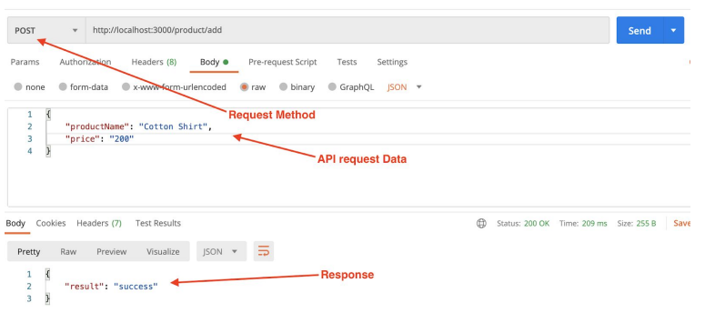
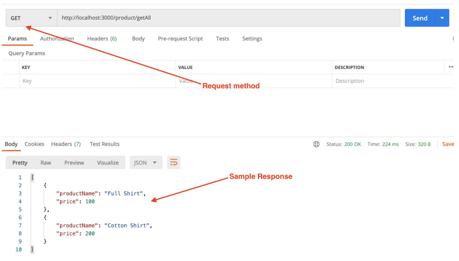

# Mongo DB assignment Board infinity

# Problem 2: 
Build a quotes generation API
Steps:
1. Create a connection with local or remote Mongo database
2. Build a model in express.js for quotes details
The model should have following parameters of type string:-
quote, author
3. Next build a API route as shown below and write logic to add a quote sent from API
below into MongoDB database

### Request URL:- http://localhost:3000/quote/add
### Request Method:- POST
### Request JSON:- 
{
 "quote": "I was never afraid of failure; for I would sooner fail than not be among
the greatest.",
 "author": "JOHN KEATS"
}

### Response JSON:-
{
 "result": "Success"
}

4. Once quote details are saved to database, build another API which can be used to
get all the saved quotes as shown below:-

### Request URL:- http://localhost:3000/quote/getAll
### Request Method:- GET
### Sample Response JSON:-

[
 {
 "quote": "You never really understand a person until you consider things from his
point of view. Until you climb inside of his skin and walk around in it.",
 "author": "HARPER LEE"
 },
 {
 "quote": "I was never afraid of failure; for I would sooner fail than not be
among the greatest.",
 "author": "JOHN KEATS"
 }
]
### Learnings
How to create APIs with database connection in express.js

### `node server`

Runs the server in the development mode.
Open [http://localhost:3000](http://localhost:3000) to view it in your browser.

